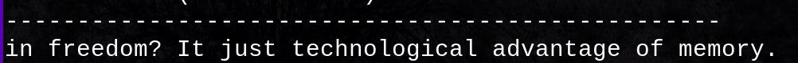

# Markov chain sentence generator
This console program takes a text file, trains based on the content, and produces a random string by a Markov chain ;D.

There are 2 modes:
1. Normal mode - Generates only one sentence
2. Shitposting mode - Generates many short sentences one by one

## Mechanism
The mechanism is simple, let's see an example. First, dictionary is generated from separate words of a text file.

E.g. we have a dictionary ["in", "the", "area", "of", "the", "south"] generated from source file

Next, ngrams are generated from the dictionary. An example of all possible 2-order ngrams:

```
in the
the area
area of
of the
the south
```

One ngram is randomly chosen. For example, let it be "in the"

Next, we choose "good" ngrams from the list - these, the first word of which starts with "the" (to continue current sentence):

```
the area
the south
```

We randomly choose one of them. Let it be "the south". Now we add it to the sentence, and get:

"in the south"

Unfortunately, there is no ngrams, which start with "south", so we add a dot and output a finished sentence. If we use long text, e.g. books, we get much more possible interesting combinations ;D



## How to install
For installation you need a C++ compiler which supports C++17. Clone the repository to your computer:

```
git clone https://github.com/sekvanto/markov-chain-sentence-generator
cd markov-chain-sentence-generator
```

Then compile the project (need to include all files in src/). Example for g++:

```
g++ -std=c++17 src/* -o bin
```

Currently, the program supports only unix-like operating systems

## Usage

Execute a compiled binary. You will need to choose a source file of text, then the mode (normal/shitpost):


If you want to add new source files, add them to assets/
